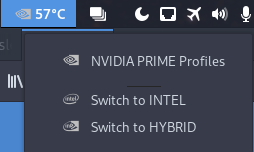

# Optimus Manager Indicator

## Install

1. git clone https://github.com/CZemft/Optimus-Manager-Indicator.git
2. rename Optimus-Manager-Indicator to optimus-manager-indicator@andr3slelouch.github.com
3. place optimus-manager-indicator@andr3slelouch.github.com in ~/.local/share/gnome-shell/extensions/
4. logout or restart gnome shell(does not work for me) log back in start your extensions good to go

Note: The GPU mode activated doesn't show up in the options, by example: When you turn on the PC you are gonna be in Intel mode so Intel option is not gonna be shown.
